<div align="center">

# 🐍🏆 Python Basics – SVEC


### 🚀 *Master Python Fundamentals - From Scratch!*

**Welcome to your comprehensive Python learning journey!**  
Everything you need to build a strong foundation in Python programming.

[📚 Start Learning](#-topics-covered) • [💻 Practice Questions](#-practice-questions) • [🎯 What's Next](#-whats-next)

---

</div>

## 🎯 Quick Navigation

<table>
<tr>
<td width="50%" align="center">

### 📖 **Core Concepts**
Variables, Data Types & String Functions

[Jump to Topics →](#-topics-covered)

</td>
<td width="50%" align="center">

### 🏆 **Questions**
Practice Problems & Solutions

[See Questions →](#-practice-questions)

</td>
</tr>
</table>

---

## 📊 Learning Progress

```
Day 1 - Python Basics, Strings & Type Conversion:
████████████████████████████████ 100%

✅ Python Basics - Introduction and Setup
✅ Variables - Declaration and Assignment
✅ Data Types - Integers, Floats, Strings, Booleans
✅ Arithmetic Operators ( + , - , * , / , % , ** )
✅ Relational / Comparison Operators ( == , != , > , < , >= , <= )
✅ Assignment Operators ( = , += , -= , *= , /= , %= , **= )
✅ Logical Operators ( not , and , or )
✅ Input & Output - input() and print() functions
✅ Type Conversion & Casting - int(), float(), str(), bool()
✅ String In-Built Functions (13+ methods covered)
✅ 15+ Practice Questions Solved

Day 2 - Conditional Statements:
████████████████████████████████ 100%

✅ if, else, elif statements
✅ if-else ladder
✅ Switch case alternative patterns

Day 3 - Loops Complete & Data Structures (Lists):
████████████████████████████████ 100%

✅ for Loop - Iteration with range()
✅ while Loop - Condition-based iteration
✅ Loop Control Statements - break and continue
✅ Nested Loops - Loops within loops
✅ for-else & while-else - Loop with else clause
✅ Iterating over Sequences - Lists, strings, ranges
✅ Loop Optimization & Best Practices
✅ Lists - Creation and initialization
✅ List Indexing - Accessing elements by position
✅ List Slicing - Extracting sublists
✅ List Methods - append(), remove(), pop(), reverse(), count(), sort()
✅ 20+ Practice Questions Solved

Day 4 - Data Structures (Tuples and Sets):
████████████████████████████████ 100%

✅ Tuples - Immutable sequences
✅ Sets - Unordered collections of unique elements
✅ Tuple Methods - count() and index()
✅ Tuple Conversion - Converting tuples to lists
✅ Set Operations - Union, Intersection, Difference
✅ Finding Duplicates - Using sets to identify duplicate elements
✅ 8+ Practice Questions Solved

Day 5 - Problem Solving with Patterns:
████████████████████████████████ 100%

✅ Number Patterns - Star patterns, Triangle patterns, Diamond patterns
✅ Number Patterns with Digits - Printing numbers in patterns
✅ String Patterns with Characters - Using ASCII values and chr() function
✅ Pattern Variations - Reverse patterns, inverted pyramids
✅ 2D Array Concepts with Nested Loops - Working with rows and columns
✅ List Comprehension with Patterns - Generating patterns efficiently
✅ Problem-Solving Approach - Analyzing pattern logic step-by-step
✅ Pyramid Pattern with Spacing - Centered pyramids with numbers

Day 6 - Functions & Modular Programming:
░░░░░░░░░░░░░░░░░░░░░░░░░░░░░░░░░ 0%

⏳ Function definition and calling
⏳ Parameters and return values
⏳ Variable scope (local vs global)
⏳ Recursion

Day 7 - File Handling & I/O Operations:
░░░░░░░░░░░░░░░░░░░░░░░░░░░░░░░░░ 0%

⏳ File operations (read, write, append)
⏳ Context managers (with statement)
⏳ Exception handling (try-except)

Day 8 - Classes and Objects:
░░░░░░░░░░░░░░░░░░░░░░░░░░░░░░░░░ 0%

⏳ Class definition
⏳ Attributes and methods
⏳ Constructors (__init__)

Day 9 - Object-Oriented Programming (OOPS):
░░░░░░░░░░░░░░░░░░░░░░░░░░░░░░░░░ 0%

⏳ Inheritance
⏳ Polymorphism
⏳ Encapsulation
⏳ Abstraction

Day 10 - Problem Solving (with AI Assistant):
░░░░░░░░░░░░░░░░░░░░░░░░░░░░░░░░░ 0%

⏳ Mini-projects
⏳ Real-world problem solving
⏳ AI-assisted debugging and optimization
```

---

## �️ Learning Path

```mermaid
graph LR
    A["📚 Day 1<br/>Basics & Strings"] --> B["🎯 Day 2<br/>Conditions & Loops"]
    B --> C["🔄 Day 3<br/>Loops Complete"]
    C --> D["📊 Day 4<br/>Data Structures"]
    D --> E["🧩 Day 5<br/>Pattern Solving"]
    E --> F["⚙️ Day 6<br/>Functions"]
    F --> G["📁 Day 7<br/>File Handling"]
    G --> H["🎨 Day 8<br/>Classes"]
    H --> I["🏛️ Day 9<br/>OOPS"]
    I --> J["🚀 Day 10<br/>AI Problem Solving"]
    
    style A fill:#90EE90,stroke:#333,color:#000
    style B fill:#90EE90,stroke:#333,color:#000
    style C fill:#90EE90,stroke:#333,color:#000
    style D fill:#6BCB77,stroke:#333,color:#000
    style E fill:#4D96FF,stroke:#333,color:#fff
    style F fill:#7C3AED,stroke:#333,color:#fff
    style G fill:#EC4899,stroke:#333,color:#fff
    style H fill:#F59E0B,stroke:#333,color:#000
    style I fill:#3B82F6,stroke:#333,color:#fff
    style J fill:#10B981,stroke:#333,color:#fff
```



---

## �📚 Topics Covered - Day 1

### ✅ Fundamentals
- **Python Basics** - Introduction and Setup
- **Variables** - Declaration and Assignment
- **Data Types** - Integers, Floats, Strings, Booleans
- **Arithmetic Operators** ( `+` , `-` , `*` , `/` , `%` , `**` )
- **Relational / Comparison Operators** ( `==` , `!=` , `>` , `<` , `>=` , `<=` )
- **Assignment Operators** ( `=` , `+=` , `-=` , `*=` , `/=` , `%=` , `**=` )
- **Logical Operators** ( `not` , `and` , `or` )
- **Input & Output** - `input()`, `print()` functions

### ✅ String In-Built Functions
- **Case Conversion** - `upper()`, `lower()`, `capitalize()`, `title()`, `swapcase()`
- **Searching** - `find()`, `index()`, `count()`
- **Manipulation** - `strip()`, `split()`, `join()`, `replace()`, `slice()`
- **Validation** - `isdigit()`, `isalpha()`, `isspace()`, `startswith()`, `endswith()`
- **Formatting** - String concatenation, f-strings

### ✅ Type Conversion & Casting
- **Automatic Type Conversion** - Implicit conversion by Python
- **Manual Type Casting** - `int()`, `float()`, `str()`, `bool()`
- **Type Checking** - `type()` function
- **String to Number** - Converting strings to integers and floats
- **Type Errors** - Understanding and handling conversion errors

---

## 📚 Topics Covered - Day 2

### ✅ Conditional Statements
- **if Statements** - Basic conditional execution
- **else Statements** - Alternative execution path
- **elif Statements** - Multiple condition checking
- **if-else Ladder** - Chained conditional statements
- **Nested if Statements** - Conditionals within conditionals
- **Switch Case Patterns** - Alternative to if-else chains (using if-elif-else)
- **Logical Operators in Conditions** - Combining conditions with `and`, `or`, `not`
- **Comparison Operators** - Using `==`, `!=`, `>`, `<`, `>=`, `<=` in conditions

---

## 📚 Topics Covered - Day 3

### ✅ Loop Fundamentals
- **for Loop** - Iteration with `range()`, iterating over sequences
- **while Loop** - Condition-based iteration and loop control
- **Loop Control Statements** - `break` statement to exit loops, `continue` to skip iterations
- **for-else & while-else** - Else clause execution when loop completes normally
- **Nested Loops** - Loops within loops for complex iterations
- **Iterating over Sequences** - Looping through lists, strings, and ranges
- **Loop Optimization** - Writing efficient and clean loop code

### ✅ Lists - Introduction to Data Structures
- **List Creation & Initialization** - Creating lists with `[]` and `list()`
- **List Indexing** - Accessing elements using positive and negative indices
- **List Slicing** - Extracting sublists using `[start:end:step]`
- **List Methods** - `append()`, `remove()`, `pop()`, `reverse()`, `count()`, `sort()`
- **Iterating Lists** - Using for loops to process list elements
- **List Operations** - Adding elements, modifying, and removing items
- **List Properties** - Understanding mutability and reference behavior

---

## 🏆 Practice Questions

### Questions Covered - Day 1

#### 📝 **Basic Operations & Input/Output:**
1. ✅ Simple print with separator (`sep` parameter)
2. ✅ Addition of two numbers and displaying sum
3. ✅ Compound assignment operators (`+=`)
4. ✅ Type conversion - String to Integer
5. ✅ Type checking using `type()` function
6. ✅ Taking user input for name, age, and city
7. ✅ F-string formatting for output

#### 📝 **Mathematical Operations:**
8. ✅ **Q1:** Sum of two numbers with user input
9. ✅ **Q2:** Area of a square using exponent operator (`**`)
10. ✅ **Q3:** Average of two numbers using floor division (`//`)
11. ✅ **Q4:** Comparison operators - Checking if a >= b

#### 📝 **String Operations & Methods:**
12. ✅ String reversal using slicing (`[::-1]`)
13. ✅ String indexing - Comparing first and last characters
14. ✅ **String Methods Practiced:**
    - `.capitalize()` - Capitalize first letter
    - `.count()` - Count character occurrences
    - `.endswith()` - Check if string ends with substring
    - `.find()` - Find character position
    - `.index()` - Find index of character
    - `.replace()` - Replace characters
    - `.swapcase()` - Toggle case of characters
    - `.upper()` - Convert to uppercase

#### 📝 **Complex Problem:**
15. ✅ **Email Validation:** Check if email ends with ".com" AND contains "@" (using logical operators `and` and `in`)

**Total Questions Practiced: 15+** 🎉

---

### Questions Covered - Day 2

#### 📝 **Intro to Python Topic - byteXL Platform (8 Questions):**
Basic Python fundamentals covering print statements, variable assignments, basic arithmetic, type conversion, and simple data manipulation exercises for beginners.

#### 📝 **Variables Topic - byteXL Platform (7 Questions):**
Comprehensive practice on variable declaration, assignment, manipulation, and understanding scope in Python with real-world examples.


#### 📝 **Conditional Statements Topic (8 Questions):**
1. ✅ Check if a string given as input is which dataType (String, Integer, Float)
2. ✅ Age category classifier (Adult, Senior Citizen, Minor)
3. ✅ Age category with nested if statements
4. ✅ Traffic signal color handler (Red, Yellow, Green)
5. ✅ Student grade calculator (Grade A, B, C, D)
6. ✅ Simplified grade calculator with chained elif
7. ✅ Odd or Even number checker
8. ✅ Username format validator
9. ✅ Find maximum of 3 numbers
10. ✅ Multiple of 7 checker
11. ✅ Generic multiple checker (divisibility for any divisor)

**Total Questions Practiced Today - Day 2: 24+** 🎉

---

### Questions Covered - Day 3

#### 📝 **Loop Control & Iteration (7 Questions):**
1. ✅ Print numbers 1 to 100 using for loop with `range()`
2. ✅ Print numbers 100 to 1 in reverse order
3. ✅ Print even numbers from 2 to 20
4. ✅ Multiplication table generator with user input
5. ✅ Countdown loop using while loop
6. ✅ Loop control with `break` - Exit loop at specific condition
7. ✅ Loop control with `continue` - Skip iterations

#### 📝 **Mathematical Problems with Loops (4 Questions):**
8. ✅ **Sum of N Numbers** - Using while loop to calculate sum from 1 to N
9. ✅ **Factorial Calculator** - Computing factorial using for loop
10. ✅ **Iterating over Lists** - Accessing elements by index using for loop
11. ✅ **Direct List Iteration** - Using for-in loop for cleaner syntax

#### 📝 **Lists Operations & Methods (5 Questions):**
12. ✅ **List Methods Practice** - Using append(), count(), remove(), reverse()
13. ✅ **List Manipulation** - Adding and removing elements dynamically
14. ✅ **Loop Control with else** - Understanding for-else execution
15. ✅ **List Creation in Loop** - Generating lists of squares dynamically
16. ✅ **List Comprehension Introduction** - Creating lists with loops

#### 📝 **Advanced Loop Concepts (4+ Questions):**
17. ✅ **Nested Loops** - Loop within loop for complex patterns
18. ✅ **Break Statement** - Exiting loops prematurely
19. ✅ **Continue Statement** - Skipping loop iterations
20. ✅ **Loop Optimization** - Writing efficient and readable loops

**Total Questions Practiced Today - Day 3: 20+** 🎉

---

## 📚 Topics Covered - Day 4

### ✅ Tuples - Immutable Sequences
- **Tuple Creation & Initialization** - Creating tuples with `()` and `tuple()`
- **Single Element Tuple** - Creating a tuple with one element using `(x,)` notation
- **Tuple Indexing** - Accessing elements using positive and negative indices
- **Tuple Slicing** - Extracting sublists using `[start:end:step]`
- **Tuple Immutability** - Understanding that tuples cannot be modified
- **Tuple Methods** - `count()` to count occurrences, `index()` to find element position
- **Tuple Conversion** - Converting tuples to lists using `list()` for manipulation, then back to tuple
- **Sorting Tuples** - Converting to list, sorting, and working with results
- **Iterating Tuples** - Using for loops to process tuple elements
- **Tuple Unpacking** - Assigning tuple elements to multiple variables

### ✅ Sets - Unordered Collections of Unique Elements
- **Set Creation & Initialization** - Creating sets with `{}` and `set()`
- **Empty Set Creation** - Using `set()` instead of `{}` to avoid creating dictionaries
- **Set Uniqueness** - Automatically removing duplicate elements
- **Set Methods** - Basic operations and set manipulations
- **Set Operations** - 
  - **Union** - Combining sets using `union()` or `|` operator
  - **Intersection** - Finding common elements using `intersection()` or `&` operator
  - **Difference** - Finding elements in one set but not another
- **Finding Duplicates in Lists** - Converting lists to sets and comparing
- **Removing Duplicates** - Using sets to eliminate duplicate values from lists
- **Nested Set Operations** - Complex set manipulations for data analysis
- **Iterating Sets** - Using for loops to process set elements

---

### Questions Covered - Day 4

#### 📝 **Tuples Operations (3 Questions):**
1. ✅ **Count and Index Operations** - Using `count()` to count occurrences of elements in a tuple
2. ✅ **Tuple Conversion to List** - Converting tuple to list, sorting, and manipulating data
3. ✅ **Odd and Even Count** - Iterating through a tuple to count odd and even elements

#### 📝 **Sets & Duplicate Detection (5+ Questions):**
4. ✅ **Finding Common Words** - Using `intersection()` to find common words in two text strings
5. ✅ **Finding All Unique Words** - Using `union()` to combine and count unique words from multiple texts
6. ✅ **Detecting Duplicates (Method 1)** - Using count() in lists to find duplicate elements
7. ✅ **Detecting Duplicates (Method 2)** - Using nested loops to identify duplicate elements
8. ✅ **Detecting Duplicates (Method 3)** - Using sets to efficiently find duplicate elements with occurrence counting

**Key Concepts Practiced:**
- 🔹 Set intersection for common elements
- 🔹 Set union for combining unique elements
- 🔹 Tuple immutability and conversion to mutable data structures
- 🔹 Multiple approaches to duplicate detection (list methods, nested loops, sets)
- 🔹 Counting elements in tuples
- 🔹 String operations with sets (splitting and set conversion)

**Total Questions Practiced Today - Day 4: 8+** 🎉

---

## � Topics Covered - Day 5

### ✅ Pattern Fundamentals
- **Basic Patterns** - Rectangle and square patterns using nested loops
- **Star Patterns** - Printing asterisks in various geometric shapes
- **Pyramid Patterns** - Creating right triangles, isosceles triangles, and pyramids
- **Inverted Patterns** - Reverse triangles and upside-down pyramids
- **Pattern Logic** - Understanding the relationship between row and column indices

### ✅ Number Patterns
- **Number Pyramid** - Printing numbers 1 to n in pyramid formation
- **Repeated Row Numbers** - Each row displays the row number n times
- **Digit Sequences** - Sequential numbers in rows (1, 2, 3... in each row)
- **Right Triangle Numbers** - Progressive numbers in triangular formation

### ✅ Character & ASCII Patterns
- **ASCII Character Patterns** - Using `chr()` and `ord()` functions for character manipulation
- **Alphabetic Patterns** - Creating patterns with letters
- **Character Ranges** - Working with ASCII values to generate character sequences

### ✅ 2D List/Matrix Concepts (Introduction)
- **Nested Loops for Matrices** - Understanding row-column iteration
- **Matrix-like Pattern Generation** - Creating multi-dimensional output
- **Spacing and Alignment** - Adding spaces for proper pattern alignment
- **Centered Patterns** - Creating centered pyramid patterns with proper formatting

### ✅ Advanced Pattern Solving
- **Centered Pyramid** - Diamond and centered patterns with calculated spacing
- **Dynamic Pattern Size** - Patterns that scale based on user input (n value)
- **Pattern Complexity** - Combining multiple pattern types in one problem
- **Code Optimization** - Writing efficient pattern generation code

---

### Questions Covered - Day 5

#### 📝 **Basic Pattern Problems (8+ Questions):**
1. ✅ **Simple Rectangle Pattern** - Print n×n grid of asterisks using nested loops
2. ✅ **Right Triangle Pattern** - Print increasing asterisks pattern (*,  * *, * * *)
3. ✅ **Number Pyramid (1)** - Print numbers incrementing in each row
4. ✅ **Number Pyramid (2)** - Print row number repeated n times
5. ✅ **Inverted Triangle** - Print decreasing asterisks pattern
6. ✅ **Decreasing Spaces Pattern** - Print asterisks with decreasing leading spaces
7. ✅ **ASCII Character Pattern** - Using chr() function with ASCII values
8. ✅ **Character Pyramid** - Print alphabetic characters in pyramid shape

#### 📝 **2D Concepts & Advanced Problems:**
9. ✅ **Centered Number Pyramid** - Print pyramid with proper spacing and row numbers
10. ✅ **Matrix Understanding** - Nested loops simulating 2D array/matrix iteration
11. ✅ **Dynamic Pattern Sizing** - Patterns that adjust based on input value

#### 📝 **Array/List Problem-Solving (Previously Covered):**
12. ✅ **Two Sum Problem** - Find pairs in array that sum to target value
13. ✅ **Finding Duplicates** - Identify duplicate elements in array using nested loops

**Key Concepts Practiced:**
- 🔹 Nested loops for multi-dimensional output
- 🔹 Loop index manipulation for pattern generation
- 🔹 ASCII values and character printing
- 🔹 Spacing calculations for pattern alignment
- 🔹 Introduction to 2D iteration concepts
- 🔹 Debugging pattern logic step-by-step

**Total Questions Practiced Today - Day 5: 13+** 🎉

---

- Review all string methods and practice with real-world examples
- Focus on understanding the "why" behind each function
- Practice daily for better retention

---

## 📚 Learning Resources

- 📖 **Official Python Documentation:** https://docs.python.org/3/
- 🎥 **Video Tutorials:** YouTube channels like Corey Schafer, CodeWithHarry
- 🔗 **Practice Platforms:** [byteXL](https://bytexl.app/), [HackerRank](https://www.hackerrank.com/), [LeetCode](https://www.leetcode.com/), [CodeChef](https://www.codechef.com/)
- 📚 **Interactive Learning:** W3Schools Python Tutorial, DataCamp

---

## 💡 Tips for Students

| Category | Tips |
|:---------|:-----|
| **📖 Learning** | Understand concepts before memorizing code |
| **💪 Practice** | Solve 10 problems daily |
| **🎨 Creativity** | Modify code and experiment with variations |
| **🐛 Debugging** | Use print statements to trace execution |
| **💬 Discussion** | Discuss doubts with peers and instructors |

---

## 📞 Support & Contact

- **Ask for help** during class hours
- **Review class notes** regularly
- **Practice consistently** for skill building
- **Participate actively** in group discussions

---

## 💡 Self-Study Tips for Each Topic

#### 🎯 When Learning Conditional Statements:
- **Step 1:** Understand if-else flow with simple examples
- **Step 2:** Manually trace decision logic (what path executes?)
- **Step 3:** Implement with real-world scenarios (age check, grade calculator)
- **Step 4:** Practice multiple conditions (if-elif-else chains)
- **Practice Problems:** Temperature check, Grade assignment, Login system
- **Time to Master:** 1-2 days with 5-10 problems

#### 🔄 When Learning Loops:
- **Step 1:** Understand loop iteration concept
- **Step 2:** Write loops to print patterns (triangle, pyramid)
- **Step 3:** Use loops with conditional statements
- **Step 4:** Master break and continue statements
- **Practice Problems:** Multiplication table, Number patterns, Sum of series
- **Time to Master:** 2-3 days with 10-15 problems

#### 📊 When Learning Data Structures (Lists, Tuples, Dicts):
- **Step 1:** Create and access elements
- **Step 2:** Learn built-in methods (append, remove, pop, etc.)
- **Step 3:** Understand indexing and slicing
- **Step 4:** Combine with loops for iteration
- **Practice Problems:** List operations, Sorting, Searching
- **Time to Master:** 3-4 days with 15-20 problems

#### 📚 When Learning Functions:
- **Step 1:** Understand function definition and calling
- **Step 2:** Work with parameters and return values
- **Step 3:** Grasp variable scope (local vs global)
- **Step 4:** Implement recursion with base cases
- **Practice Problems:** Calculator functions, Factorial, Fibonacci
- **Time to Master:** 3-4 days with 10-15 problems

#### 💾 When Learning File Handling:
- **Step 1:** Open, read, and close files
- **Step 2:** Understand different modes (read, write, append)
- **Step 3:** Work with context managers (with statement)
- **Step 4:** Handle exceptions (FileNotFoundError, IOError)
- **Practice Problems:** Log file reading, Data processing, CSV handling
- **Time to Master:** 2 days with 5-10 problems

#### 🎓 When Learning OOP:
- **Step 1:** Understand classes and objects
- **Step 2:** Define attributes and methods
- **Step 3:** Learn inheritance and polymorphism
- **Step 4:** Practice encapsulation (public/private members)
- **Practice Problems:** Student class, Bank account, Game characters
- **Time to Master:** 4-5 days with 15-20 problems

---

## 📊 Recommended Problem Sources

| Platform | Topics | Best For | Difficulty Range |
|:---------|:-------|:---------|:----------------:|
| [](https://bytexl.app/) | Interactive coding | Hands-on practice | Easy → Medium |
| [](https://www.hackerrank.com/) | All Python concepts | Structured learning | Easy → Hard |
| [](https://www.leetcode.com/) | Problem-solving | Interview preparation | Easy → Hard |
| [](https://www.codechef.com/) | Competitive programming | Contests & challenges | Medium → Hard |
| [](https://www.geeksforgeeks.org/) | Theory + Code | Concept understanding | Easy → Medium |
| [](https://codeforces.com/) | Algorithm practice | Advanced challenges | Medium → Hard |
| [](https://www.codewars.com/) | Skill-based problems | Gamified learning | Easy → Hard |

---

## 🏆 Success Tips

| Tip | Why It Works |
|:----|:------------|
| **Code Every Day** | Builds muscle memory and intuition |
| **Read Error Messages** | Errors guide you to solutions |
| **Debug Step-by-Step** | Understand what your code does |
| **Rewrite Code** | Helps solidify understanding |
| **Teach Others** | Best way to learn is to explain |
| **Review Daily** | Reinforces learning and memory |
| **Join Communities** | Motivation and peer support |
| **Celebrate Small Wins** | Builds confidence and momentum |

---

## 🤝 Need Help?

<div align="center">

### Got stuck? Don't worry!

**💬 Ask Questions** | **🐛 Report Issues** | **💡 Share Ideas**

Remember: *Every expert was once a beginner!*

---

### 🌟 **Keep Coding, Keep Growing!** 🌟

<br>

<div align="center">

### ✨ Created By ✨

## <a href="https://whatsapp.com/channel/0029Vb74kBaL2ATzZBnRka19" target="_blank">✨ **Shine_Beyond_Syntax** ✨</a>

<br>

[](https://whatsapp.com/channel/0029Vb74kBaL2ATzZBnRka19)

<br>

</div>

<br>

---


