<div align="center">

# 🐍🏆 Python Basics – SVEC


### 🚀 *Master Python Fundamentals - From Scratch!*

**Welcome to your comprehensive Python learning journey!**  
Everything you need to build a strong foundation in Python programming.

[📚 Start Learning](#-topics-covered) • [💻 Practice Questions](#-practice-questions) • [🎯 What's Next](#-whats-next)

---

</div>

## 🎯 Quick Navigation

<table>
<tr>
<td width="50%" align="center">

### 📖 **Core Concepts**
Variables, Data Types & String Functions

[Jump to Topics →](#-topics-covered)

</td>
<td width="50%" align="center">

### 🏆 **Questions**
Practice Problems & Solutions

[See Questions →](#-practice-questions)

</td>
</tr>
</table>

---

## 📊 Learning Progress

```
Day 1 - Python Basics, Strings & Type Conversion:
████████████████████████████████ 100%

✅ Python Basics - Introduction and Setup
✅ Variables - Declaration and Assignment
✅ Data Types - Integers, Floats, Strings, Booleans
✅ Arithmetic Operators ( + , - , * , / , % , ** )
✅ Relational / Comparison Operators ( == , != , > , < , >= , <= )
✅ Assignment Operators ( = , += , -= , *= , /= , %= , **= )
✅ Logical Operators ( not , and , or )
✅ Input & Output - input() and print() functions
✅ Type Conversion & Casting - int(), float(), str(), bool()
✅ String In-Built Functions (13+ methods covered)
✅ 15+ Practice Questions Solved

Day 2 - Conditional Statements & Loops (Intro):
░░░░░░░░░░░░░░░░░░░░░░░░░░░░░░░░░ 0%

⏳ if, else, elif statements
⏳ if-else ladder
⏳ Switch case alternative patterns
⏳ for loop basics
⏳ while loop basics
⏳ Loop control (break, continue)

Day 3 - Loops Complete & Pattern Printing:
░░░░░░░░░░░░░░░░░░░░░░░░░░░░░░░░░ 0%

⏳ Nested loops
⏳ Pattern printing (triangles, pyramids, etc.)
⏳ Loop optimization

Day 4 - Data Structures (Lists, Tuples, Dictionaries):
░░░░░░░░░░░░░░░░░░░░░░░░░░░░░░░░░ 0%

⏳ Lists - Creation, indexing, slicing
⏳ List methods (append, remove, pop, etc.)
⏳ Tuples - Immutable sequences
⏳ Dictionaries - Key-value pairs

Day 5 - Problem Solving with Patterns:
░░░░░░░░░░░░░░░░░░░░░░░░░░░░░░░░░ 0%

⏳ Number patterns
⏳ String patterns
⏳ Complex problem solving

Day 6 - Functions & Modular Programming:
░░░░░░░░░░░░░░░░░░░░░░░░░░░░░░░░░ 0%

⏳ Function definition and calling
⏳ Parameters and return values
⏳ Variable scope (local vs global)
⏳ Recursion

Day 7 - File Handling & I/O Operations:
░░░░░░░░░░░░░░░░░░░░░░░░░░░░░░░░░ 0%

⏳ File operations (read, write, append)
⏳ Context managers (with statement)
⏳ Exception handling (try-except)

Day 8 - Classes and Objects:
░░░░░░░░░░░░░░░░░░░░░░░░░░░░░░░░░ 0%

⏳ Class definition
⏳ Attributes and methods
⏳ Constructors (__init__)

Day 9 - Object-Oriented Programming (OOPS):
░░░░░░░░░░░░░░░░░░░░░░░░░░░░░░░░░ 0%

⏳ Inheritance
⏳ Polymorphism
⏳ Encapsulation
⏳ Abstraction

Day 10 - Problem Solving (with AI Assistant):
░░░░░░░░░░░░░░░░░░░░░░░░░░░░░░░░░ 0%

⏳ Mini-projects
⏳ Real-world problem solving
⏳ AI-assisted debugging and optimization
```

---

## �️ Learning Path

```mermaid
graph LR
    A["📚 Day 1<br/>Basics & Strings"] --> B["🎯 Day 2<br/>Conditions & Loops"]
    B --> C["🔄 Day 3<br/>Loops Complete"]
    C --> D["📊 Day 4<br/>Data Structures"]
    D --> E["🧩 Day 5<br/>Pattern Solving"]
    E --> F["⚙️ Day 6<br/>Functions"]
    F --> G["📁 Day 7<br/>File Handling"]
    G --> H["🎨 Day 8<br/>Classes"]
    H --> I["🏛️ Day 9<br/>OOPS"]
    I --> J["🚀 Day 10<br/>AI Problem Solving"]
    
    style A fill:#FF6B6B,stroke:#333,color:#000
    style B fill:#FFA500,stroke:#333,color:#000
    style C fill:#FFD93D,stroke:#333,color:#000
    style D fill:#6BCB77,stroke:#333,color:#000
    style E fill:#4D96FF,stroke:#333,color:#fff
    style F fill:#7C3AED,stroke:#333,color:#fff
    style G fill:#EC4899,stroke:#333,color:#fff
    style H fill:#F59E0B,stroke:#333,color:#000
    style I fill:#3B82F6,stroke:#333,color:#fff
    style J fill:#10B981,stroke:#333,color:#fff
```



---

## �📚 Topics Covered - Day 1

### ✅ Fundamentals
- **Python Basics** - Introduction and Setup
- **Variables** - Declaration and Assignment
- **Data Types** - Integers, Floats, Strings, Booleans
- **Arithmetic Operators** ( `+` , `-` , `*` , `/` , `%` , `**` )
- **Relational / Comparison Operators** ( `==` , `!=` , `>` , `<` , `>=` , `<=` )
- **Assignment Operators** ( `=` , `+=` , `-=` , `*=` , `/=` , `%=` , `**=` )
- **Logical Operators** ( `not` , `and` , `or` )
- **Input & Output** - `input()`, `print()` functions

### ✅ String In-Built Functions
- **Case Conversion** - `upper()`, `lower()`, `capitalize()`, `title()`, `swapcase()`
- **Searching** - `find()`, `index()`, `count()`
- **Manipulation** - `strip()`, `split()`, `join()`, `replace()`, `slice()`
- **Validation** - `isdigit()`, `isalpha()`, `isspace()`, `startswith()`, `endswith()`
- **Formatting** - String concatenation, f-strings

### ✅ Type Conversion & Casting
- **Automatic Type Conversion** - Implicit conversion by Python
- **Manual Type Casting** - `int()`, `float()`, `str()`, `bool()`
- **Type Checking** - `type()` function
- **String to Number** - Converting strings to integers and floats
- **Type Errors** - Understanding and handling conversion errors

---

## 🏆 Practice Questions

### Questions Covered Today - Day 1

#### 📝 **Basic Operations & Input/Output:**
1. ✅ Simple print with separator (`sep` parameter)
2. ✅ Addition of two numbers and displaying sum
3. ✅ Compound assignment operators (`+=`)
4. ✅ Type conversion - String to Integer
5. ✅ Type checking using `type()` function
6. ✅ Taking user input for name, age, and city
7. ✅ F-string formatting for output

#### 📝 **Mathematical Operations:**
8. ✅ **Q1:** Sum of two numbers with user input
9. ✅ **Q2:** Area of a square using exponent operator (`**`)
10. ✅ **Q3:** Average of two numbers using floor division (`//`)
11. ✅ **Q4:** Comparison operators - Checking if a >= b

#### 📝 **String Operations & Methods:**
12. ✅ String reversal using slicing (`[::-1]`)
13. ✅ String indexing - Comparing first and last characters
14. ✅ **String Methods Practiced:**
    - `.capitalize()` - Capitalize first letter
    - `.count()` - Count character occurrences
    - `.endswith()` - Check if string ends with substring
    - `.find()` - Find character position
    - `.index()` - Find index of character
    - `.replace()` - Replace characters
    - `.swapcase()` - Toggle case of characters
    - `.upper()` - Convert to uppercase

#### 📝 **Complex Problem:**
15. ✅ **Email Validation:** Check if email ends with ".com" AND contains "@" (using logical operators `and` and `in`)

**Total Questions Practiced: 15+** 🎉

---

## 📝 Notes

- Review all string methods and practice with real-world examples
- Focus on understanding the "why" behind each function
- Practice daily for better retention

---
<!-- 
## 🎖️ Learning Path Priority Guide

#### Phase 1 - MUST LEARN (Tomorrow's Focus)
```
Day 2: Conditional Statements & Loops (Introduction)
├── if, else, elif statements
├── if-else ladder
├── Switch case alternative patterns
├── for loop basics
├── while loop basics
└── Loop control (break, continue)
```

#### Phase 2 - IMPORTANT (Upcoming Days)
```
Days 3-5: Data Structures & Functions
├── Lists and basic operations
├── Tuples and Sets
├── Dictionaries (key-value pairs)
├── Functions and recursion
└── Scope and closures
```

#### Phase 3 - VALUABLE (Week 2+)
```
Days 6-7: File Handling & OOP
├── File operations (read, write, append)
├── Exception handling (try-except)
├── Classes and Objects basics
├── Inheritance and Polymorphism
└── Encapsulation
```

#### Phase 4 - ADVANCED (Week 3+)
```
Advanced Topics:
├── Decorators and Generators
├── List comprehension & Lambda
├── Regular Expressions
├── Libraries (NumPy, Pandas)
└── Web Development basics
```

--- -->

## 📚 Learning Resources

- 📖 **Official Python Documentation:** https://docs.python.org/3/
- 🎥 **Video Tutorials:** YouTube channels like Corey Schafer, CodeWithHarry
- 🔗 **Practice Platforms:** [byteXL](https://bytexl.app/), [HackerRank](https://www.hackerrank.com/), [LeetCode](https://www.leetcode.com/), [CodeChef](https://www.codechef.com/)
- 📚 **Interactive Learning:** W3Schools Python Tutorial, DataCamp

---

## 💡 Tips for Students

| Category | Tips |
|:---------|:-----|
| **📖 Learning** | Understand concepts before memorizing code |
| **💪 Practice** | Solve 10 problems daily |
| **🎨 Creativity** | Modify code and experiment with variations |
| **🐛 Debugging** | Use print statements to trace execution |
| **💬 Discussion** | Discuss doubts with peers and instructors |

---

## 📞 Support & Contact

- **Ask for help** during class hours
- **Review class notes** regularly
- **Practice consistently** for skill building
- **Participate actively** in group discussions

---

## 💡 Self-Study Tips for Each Topic

#### 🎯 When Learning Conditional Statements:
- **Step 1:** Understand if-else flow with simple examples
- **Step 2:** Manually trace decision logic (what path executes?)
- **Step 3:** Implement with real-world scenarios (age check, grade calculator)
- **Step 4:** Practice multiple conditions (if-elif-else chains)
- **Practice Problems:** Temperature check, Grade assignment, Login system
- **Time to Master:** 1-2 days with 5-10 problems

#### 🔄 When Learning Loops:
- **Step 1:** Understand loop iteration concept
- **Step 2:** Write loops to print patterns (triangle, pyramid)
- **Step 3:** Use loops with conditional statements
- **Step 4:** Master break and continue statements
- **Practice Problems:** Multiplication table, Number patterns, Sum of series
- **Time to Master:** 2-3 days with 10-15 problems

#### 📊 When Learning Data Structures (Lists, Tuples, Dicts):
- **Step 1:** Create and access elements
- **Step 2:** Learn built-in methods (append, remove, pop, etc.)
- **Step 3:** Understand indexing and slicing
- **Step 4:** Combine with loops for iteration
- **Practice Problems:** List operations, Sorting, Searching
- **Time to Master:** 3-4 days with 15-20 problems

#### 📚 When Learning Functions:
- **Step 1:** Understand function definition and calling
- **Step 2:** Work with parameters and return values
- **Step 3:** Grasp variable scope (local vs global)
- **Step 4:** Implement recursion with base cases
- **Practice Problems:** Calculator functions, Factorial, Fibonacci
- **Time to Master:** 3-4 days with 10-15 problems

#### 💾 When Learning File Handling:
- **Step 1:** Open, read, and close files
- **Step 2:** Understand different modes (read, write, append)
- **Step 3:** Work with context managers (with statement)
- **Step 4:** Handle exceptions (FileNotFoundError, IOError)
- **Practice Problems:** Log file reading, Data processing, CSV handling
- **Time to Master:** 2 days with 5-10 problems

#### 🎓 When Learning OOP:
- **Step 1:** Understand classes and objects
- **Step 2:** Define attributes and methods
- **Step 3:** Learn inheritance and polymorphism
- **Step 4:** Practice encapsulation (public/private members)
- **Practice Problems:** Student class, Bank account, Game characters
- **Time to Master:** 4-5 days with 15-20 problems

---

## 📊 Recommended Problem Sources

| Platform | Topics | Best For | Difficulty Range |
|:---------|:-------|:---------|:----------------:|
| [](https://bytexl.app/) | Interactive coding | Hands-on practice | Easy → Medium |
| [](https://www.hackerrank.com/) | All Python concepts | Structured learning | Easy → Hard |
| [](https://www.leetcode.com/) | Problem-solving | Interview preparation | Easy → Hard |
| [](https://www.codechef.com/) | Competitive programming | Contests & challenges | Medium → Hard |
| [](https://www.geeksforgeeks.org/) | Theory + Code | Concept understanding | Easy → Medium |
| [](https://codeforces.com/) | Algorithm practice | Advanced challenges | Medium → Hard |
| [](https://www.codewars.com/) | Skill-based problems | Gamified learning | Easy → Hard |

---

## 🏆 Success Tips

| Tip | Why It Works |
|:----|:------------|
| **Code Every Day** | Builds muscle memory and intuition |
| **Read Error Messages** | Errors guide you to solutions |
| **Debug Step-by-Step** | Understand what your code does |
| **Rewrite Code** | Helps solidify understanding |
| **Teach Others** | Best way to learn is to explain |
| **Review Daily** | Reinforces learning and memory |
| **Join Communities** | Motivation and peer support |
| **Celebrate Small Wins** | Builds confidence and momentum |

---

## 🤝 Need Help?

<div align="center">

### Got stuck? Don't worry!

**💬 Ask Questions** | **🐛 Report Issues** | **💡 Share Ideas**

Remember: *Every expert was once a beginner!*

---

### 🌟 **Keep Coding, Keep Growing!** 🌟

<br>

<div align="center">

### ✨ Created By ✨

## <a href="https://whatsapp.com/channel/0029Vb74kBaL2ATzZBnRka19" target="_blank">✨ **Shine_Beyond_Syntax** ✨</a>

<br>

[](https://whatsapp.com/channel/0029Vb74kBaL2ATzZBnRka19)

<br>

</div>

<br>

---


