<div align="center">

# 🐍🏆 Python Basics – SVEC


### 🚀 *Master Python Fundamentals - From Scratch!*

**Welcome to your comprehensive Python learning journey!**  
Everything you need to build a strong foundation in Python programming.

[📚 Start Learning](#-topics-covered) • [💻 Practice Questions](#-practice-questions) • [🎯 What's Next](#-whats-next)

---

</div>

## 🎯 Quick Navigation

<table>
<tr>
<td width="50%" align="center">

### 📖 **Core Concepts**
Variables, Data Types & String Functions

[Jump to Topics →](#-topics-covered)

</td>
<td width="50%" align="center">

### 🏆 **Questions**
Practice Problems & Solutions

[See Questions →](#-practice-questions)

</td>
</tr>
</table>

---

## 📊 Learning Progress

```
Day 1 - Python Basics, Strings & Type Conversion:
████████████████████████████████ 100%

✅ Python Basics - Introduction and Setup
✅ Variables - Declaration and Assignment
✅ Data Types - Integers, Floats, Strings, Booleans
✅ Arithmetic Operators ( + , - , * , / , % , ** )
✅ Relational / Comparison Operators ( == , != , > , < , >= , <= )
✅ Assignment Operators ( = , += , -= , *= , /= , %= , **= )
✅ Logical Operators ( not , and , or )
✅ Input & Output - input() and print() functions
✅ Type Conversion & Casting - int(), float(), str(), bool()
✅ String In-Built Functions (13+ methods covered)
✅ 15+ Practice Questions Solved

Day 2 - Conditional Statements:
████████████████████████████████ 100%

✅ if, else, elif statements
✅ if-else ladder
✅ Switch case alternative patterns

Day 3 - Loops Complete & Data Structures (Lists):
████████████████████████████████ 100%

✅ for Loop - Iteration with range()
✅ while Loop - Condition-based iteration
✅ Loop Control Statements - break and continue
✅ Nested Loops - Loops within loops
✅ for-else & while-else - Loop with else clause
✅ Iterating over Sequences - Lists, strings, ranges
✅ Loop Optimization & Best Practices
✅ Lists - Creation and initialization
✅ List Indexing - Accessing elements by position
✅ List Slicing - Extracting sublists
✅ List Methods - append(), remove(), pop(), reverse(), count(), sort()
✅ 20+ Practice Questions Solved

Day 4 - Data Structures (Tuples and Sets):
████████████████████████████████ 100%

✅ Tuples - Immutable sequences
✅ Sets - Unordered collections of unique elements
✅ Tuple Methods - count() and index()
✅ Tuple Conversion - Converting tuples to lists
✅ Set Operations - Union, Intersection, Difference
✅ Finding Duplicates - Using sets to identify duplicate elements
✅ 8+ Practice Questions Solved

Day 5 - Problem Solving with Patterns:
████████████████████████████████ 100%

✅ Number Patterns - Star patterns, Triangle patterns, Diamond patterns
✅ Number Patterns with Digits - Printing numbers in patterns
✅ String Patterns with Characters - Using ASCII values and chr() function
✅ Pattern Variations - Reverse patterns, inverted pyramids
✅ 2D Array Concepts with Nested Loops - Working with rows and columns
✅ List Comprehension with Patterns - Generating patterns efficiently
✅ Problem-Solving Approach - Analyzing pattern logic step-by-step
✅ Pyramid Pattern with Spacing - Centered pyramids with numbers

Day 6 - Dictionaries & Functions:
████████████████████████████████ 100%

✅ Dictionaries - Data structure fundamentals
✅ Dictionary Creation, Indexing, and Access
✅ Dictionary Methods - keys(), values(), items(), get(), update()
✅ Nested Dictionaries - Multi-level key-value pairs
✅ Dictionary Manipulation - Adding and updating key-value pairs
✅ Function Definition and Calling
✅ Parameters and Return Values
✅ Multiple Parameters and Return Statements
✅ Mathematical Functions - Factorial, Permutation, Combination
✅ 8+ Practice Questions Solved

Day 7 - Recursion, File Handling, Lambda Functions & Exception Handling:
████████████████████████████████ 100%

✅ Recursion - Function calls itself with base case
✅ File Handling - Read, write, and append operations
✅ Lambda Functions - Anonymous functions with map() and filter()
✅ Exception Handling - try-except-finally blocks

Day 8 - Classes and Objects:
████████████████████████████████ 100%

✅ Class definition and object instantiation
✅ The `self` parameter and instance context
✅ Instance attributes vs Class (static) attributes
✅ Constructors (`__init__`) and default/optional parameters
✅ Instance methods and invoking methods on objects
✅ `@staticmethod` and `@classmethod` (when to use each)
✅ Attribute access, modification, and deletion (`del`)
✅ Encapsulation basics (public, protected `_name`, name-mangling `__name`)
✅ Properties and `@property` / setters for controlled access
✅ Basic composition (objects as attributes of other objects)
✅ Simple examples and exercises: `Student` class, averages, `Circle` class (area/perimeter)

### ✅ Practical Exercises 
- `Student` class examples: basic attribute access, constructors with parameters, default constructor values, and a `avg()` method to compute student averages.
- Demonstrations of instance vs class variables and `del` usage on attributes/objects.
- `Circle` class: methods for `areaOfCircle()` and `perimeterOfCircle()`, and a `@staticmethod` example.
- Suggested follow-ups: add `__str__/__repr__` to classes, implement `@classmethod` factory methods, and add input-driven object creation.

Day 9 - Object-Oriented Programming (OOPS):
░░░░░░░░░░░░░░░░░░░░░░░░░░░░░░░░░ 0%

⏳ Inheritance
⏳ Polymorphism
⏳ Encapsulation
⏳ Abstraction

Day 10 - Problem Solving (with AI Assistant):
░░░░░░░░░░░░░░░░░░░░░░░░░░░░░░░░░ 0%

⏳ Mini-projects
⏳ Real-world problem solving
⏳ AI-assisted debugging and optimization
```

---

## �️ Learning Path

```mermaid
graph LR
    A["📚 Day 1<br/>Basics & Strings"] --> B["🎯 Day 2<br/>Conditions & Loops"]
    B --> C["🔄 Day 3<br/>Loops Complete"]
    C --> D["📊 Day 4<br/>Data Structures"]
    D --> E["🧩 Day 5<br/>Pattern Solving"]
    E --> F["⚙️ Day 6<br/>Functions"]
    F --> G["📁 Day 7<br/>File Handling"]
    G --> H["🎨 Day 8<br/>Classes"]
    H --> I["🏛️ Day 9<br/>OOPS"]
    I --> J["🚀 Day 10<br/>AI Problem Solving"]
    
    style A fill:#90EE90,stroke:#333,color:#000
    style B fill:#90EE90,stroke:#333,color:#000
    style C fill:#90EE90,stroke:#333,color:#000
    style D fill:#6BCB77,stroke:#333,color:#000
    style E fill:#4D96FF,stroke:#333,color:#fff
    style F fill:#7C3AED,stroke:#333,color:#fff
    style G fill:#EC4899,stroke:#333,color:#fff
    style H fill:#90EE90,stroke:#333,color:#000
    style I fill:#3B82F6,stroke:#333,color:#fff
    style J fill:#10B981,stroke:#333,color:#fff
```



---

## �📚 Topics Covered - Day 1

### ✅ Fundamentals
- **Python Basics** - Introduction and Setup
- **Variables** - Declaration and Assignment
- **Data Types** - Integers, Floats, Strings, Booleans
- **Arithmetic Operators** ( `+` , `-` , `*` , `/` , `%` , `**` )
- **Relational / Comparison Operators** ( `==` , `!=` , `>` , `<` , `>=` , `<=` )
- **Assignment Operators** ( `=` , `+=` , `-=` , `*=` , `/=` , `%=` , `**=` )
- **Logical Operators** ( `not` , `and` , `or` )
- **Input & Output** - `input()`, `print()` functions

### ✅ String In-Built Functions
- **Case Conversion** - `upper()`, `lower()`, `capitalize()`, `title()`, `swapcase()`
- **Searching** - `find()`, `index()`, `count()`
- **Manipulation** - `strip()`, `split()`, `join()`, `replace()`, `slice()`
- **Validation** - `isdigit()`, `isalpha()`, `isspace()`, `startswith()`, `endswith()`
- **Formatting** - String concatenation, f-strings

### ✅ Type Conversion & Casting
- **Automatic Type Conversion** - Implicit conversion by Python
- **Manual Type Casting** - `int()`, `float()`, `str()`, `bool()`
- **Type Checking** - `type()` function
- **String to Number** - Converting strings to integers and floats
- **Type Errors** - Understanding and handling conversion errors

---
## 📚 Topics Covered - Day 6

### ✅ Dictionaries - Key-Value Data Structure
- **Dictionary Creation & Initialization** - Creating dictionaries with `{}` and `dict()`
- **Dictionary Indexing & Access** - Accessing values using keys `dict[key]`
- **Nested Dictionaries** - Dictionaries containing other dictionaries as values
- **Dictionary Methods** - 
  - `.keys()` - Get all keys from dictionary
  - `.values()` - Get all values from dictionary
  - `.items()` - Get key-value pairs as tuples
  - `.get()` - Safely access values with default returns
  - `.update()` - Add or modify key-value pairs
- **Dictionary Manipulation** - Adding new keys, updating existing values, removing entries
- **Iterating Dictionaries** - Looping through keys, values, and key-value pairs
- **Dictionary Applications** - Storing structured data, counting frequencies, mapping relationships

### ✅ Functions - Modular Programming
- **Function Definition** - Using `def` keyword to create reusable code blocks
- **Function Calling** - Invoking functions with proper syntax
- **Parameters & Arguments** - Defining input parameters and passing arguments
- **Return Statements** - Returning values from functions
- **Multiple Parameters** - Functions with multiple input parameters (e.g., `def add(a, b, c, d, e)`)
- **Mathematical Functions** - Creating functions for calculations (addition, factorial, etc.)
- **Function Basics** - Understanding when and why to use functions for code reusability
- **Factorial Function** - Computing factorial of a number using loops inside functions
- **Permutation & Combination** - Using factorial function to calculate nPr and nCr

---
## 📚 Topics Covered - Day 7

### ✅ Recursion - Function Calling Itself
- **Recursion Concept** - Function calling itself to solve a problem
- **Base Case** - Stopping condition to prevent infinite recursion
- **Recursive Case** - The function calling itself with modified parameters
- **Call Stack** - Understanding how recursive calls are stored in memory
- **Sum of Natural Numbers** - Computing sum from 1 to N using recursion
- **Factorial Function** - Computing n! using recursive approach
- **Advantages** - Code simplicity and elegance for tree-like problems
- **Disadvantages** - Memory overhead and potential stack overflow
- **Tail Recursion** - Recursion optimized for performance

### ✅ File Handling - Input/Output Operations
- **File Opening** - Using `open()` function with different modes ('r', 'w', 'a')
- **File Modes Explained:**
  - `'r'` (Read) - Open file for reading (default)
  - `'w'` (Write) - Open file for writing (overwrites content)
  - `'a'` (Append) - Open file for appending (adds to end)
- **Reading Files** - Using `read()`, `readline()`, and iterating through lines
- **Writing to Files** - Using `write()` method to add content
- **Closing Files** - Using `close()` method to free resources
- **Context Managers** - Using `with` statement for automatic file closing
- **File Operations** - Creating files, reading content, modifying text
- **File Renaming** - Using `os.rename()` for renaming files
- **File Deletion** - Using `os.remove()` for deleting files
- **String Replacement in Files** - Reading, modifying, and writing back data

### ✅ Lambda Functions - Anonymous Functions
- **Lambda Syntax** - `lambda arguments: expression`
- **Single Expression** - Lambda functions contain only one expression
- **No Return Statement** - Returns the result implicitly
- **Use Cases** - Simple operations where defining a function is overkill
- **Map Function** - Using `map(lambda_func, iterable)` to apply function to all elements
- **Filter Function** - Using `filter(lambda_func, iterable)` to select elements based on condition
- **Comparison with Regular Functions** - When to use lambda vs def
- **Lambda with Multiple Parameters** - Handling multiple arguments in lambda
- **Practical Examples:**
  - Doubling list elements using map
  - Finding perfect squares using map and set
  - Filtering even/odd numbers using filter

### ✅ Exception Handling - Error Management
- **try Block** - Code that might raise an exception
- **except Block** - Code to handle specific exceptions
- **Multiple except Blocks** - Handling different exception types separately
- **Exception Types:**
  - `ZeroDivisionError` - Dividing by zero
  - `NameError` - Using undefined variable
  - `ValueError` - Invalid type/value for operation
  - `IndexError` - Accessing invalid list index
  - `KeyError` - Accessing invalid dictionary key
  - `TypeError` - Wrong type in operation
- **finally Block** - Code that executes regardless of exceptions
- **Exception as Variable** - Using `except Exception as e:` to access error message
- **Generic Exception** - Using `except:` to catch all exceptions
- **Raising Exceptions** - Using `raise` keyword to throw custom exceptions
- **Exception Messages** - Displaying error details for debugging
- **Best Practices** - Catching specific exceptions instead of generic ones

---

## 📚 Topics Covered - Day 8

### ✅ Object-Oriented Programming Fundamentals - Classes and Objects

#### **Class Definition and Instantiation**
- **Class Concept** - Blueprint for creating objects (instances)
- **Class Syntax** - Using `class ClassName:` to define a class
- **Creating Objects** - Instantiating classes with `obj = ClassName()`
- **Object Identity** - Each object is unique with its own memory address

#### **The `self` Parameter**
- **self Reference** - Represents the instance in methods
- **Instance Context** - `self` allows methods to access instance attributes
- **Method Binding** - Methods are automatically bound to instances via `self`
- **Implicit Passing** - `self` is implicitly passed when calling methods

#### **Attributes and Instance Variables**
- **Instance Attributes** - Variables unique to each object (defined in `__init__`)
- **Class Attributes** - Variables shared by all instances (defined at class level)
- **Attribute Access** - Accessing via dot notation: `obj.attribute`
- **Attribute Assignment** - Setting values: `obj.attribute = value`
- **Attribute Deletion** - Using `del obj.attribute` to remove attributes

#### **Constructor (`__init__`) Method**
- **Constructor Purpose** - Initialize instance when object is created
- **Defining Constructor** - `def __init__(self, parameters):`
- **Default Parameters** - Using default values: `def __init__(self, name="anonymous")`
- **Multiple Parameters** - Accepting multiple arguments in constructor
- **Parameter to Attribute Mapping** - Converting parameters to instance attributes

#### **Instance Methods**
- **Method Definition** - Functions defined within a class
- **Method Calling** - Invoking methods: `obj.method()`
- **Method with Computations** - Methods performing calculations on attributes
- **Return Values** - Methods returning computed results or None

#### **Static Methods and Class Methods**
- **@staticmethod Decorator** - Methods that don't need instance or class access
- **When to Use Static Methods** - Utility functions related to the class
- **Syntax** - `@staticmethod` above method definition
- **Class Methods** - `@classmethod` for methods accessing class variables
- **Understanding Differences** - Static vs instance vs class methods

#### **Encapsulation and Access Control**
- **Public Attributes** - Accessible from anywhere: `attribute`
- **Protected Attributes** - Convention for internal use: `_attribute`
- **Name Mangling** - Private attributes: `__attribute` (becomes `_ClassName__attribute`)
- **Properties and Getters/Setters** - Using `@property` for controlled access
- **Benefit of Encapsulation** - Hiding implementation details

#### **Special Methods (Magic Methods / Dunder Methods)**
- **`__init__`** - Constructor for initialization
- **`__str__`** - String representation for `print()` and `str()`
- **`__repr__`** - Developer-friendly representation for debugging
- **`__del__`** - Destructor called when object is deleted
- **Understanding Purpose** - When and why to override special methods

#### **Object Composition**
- **Objects as Attributes** - Storing objects inside other objects
- **Building Complex Structures** - Combining multiple classes
- **Accessing Nested Objects** - Chaining dot notation: `obj.obj2.attribute`

#### **Practical Application - Real-World Examples**
- **Student Class** - Attributes (name, marks), methods (calculate average)
- **Circle Class** - Attributes (radius), methods (area, perimeter calculations)
- **Calculator Functions** - Performing mathematical operations within methods
- **Dynamic Object Creation** - Creating multiple instances with different data

---

## 🏆 Practice Questions - Day 8

### Questions Covered - Day 8

#### 📝 **Class Definition and Object Creation (2+ Questions):**
1. ✅ **Basic Class Definition** - Define `Student` class with simple attributes
   - Class declaration: `class Student:`
   - Instance variable: `self.name = name`

2. ✅ **Constructor with Parameters** - Create objects with initialization parameters
   - Example: `s1 = Student("Shivam")` initializes student name
   - Multiple parameters: `Student(name, sub1, sub2, sub3)` for subjects

3. ✅ **Default Constructor Values** - Using optional/default parameters
   - `def __init__(self, fullName="anonymous"):` provides default fallback
   - Creating objects without parameters: `s3 = Student()`

#### 📝 **Instance Methods and Attributes (3+ Questions):**
4. ✅ **Method Definition** - Create methods to compute values
   - Example: `avg()` method computes average of subject marks
   - Method calling: `s1.avg()` invokes method on instance

5. ✅ **Accessing Instance Attributes** - Using `self.attribute` in methods
   - Calculating with attributes: `sumOfAll = self.sub1 + self.sub2 + self.sub3`
   - Output formatting: f-strings for display: `f"{self.name}'s Average = {avgOf3}"`

6. ✅ **Multiple Object Instances** - Creating and manipulating multiple objects
   - Creating 5 `Student` objects: `s1, s2, s3, s4, s5 = Student(...)`
   - Calling method on each: `s1.avg()`, `s2.avg()`, etc.
   - Each instance maintains separate data

#### 📝 **Class vs Instance Attributes (2+ Questions):**
7. ✅ **Class Variables** - Attributes shared across all instances
   - Defining at class level: `marks = 24`
   - Accessing via instance: `s1.marks`

8. ✅ **Attribute Deletion** - Using `del` keyword on attributes
   - Deleting instance attribute: `del s1.marks`
   - Deleting entire object: `del s1`
   - Checking deletion: attribute no longer accessible

#### 📝 **Geometric Calculations with Classes (3+ Questions):**
9. ✅ **Circle Class - Attributes** - Define `Circle` with radius parameter
   - Constructor: `def __init__(self, radius):`
   - Instance variable: `self.r = radius`

10. ✅ **Circle Class - Area Method** - Calculate circle area
    - Formula: `area = (22/7) * r * r`
    - Rounding: `area = int(area)`
    - Output: `f"Area of a Circle with radius {self.r} = {area}"`

11. ✅ **Circle Class - Perimeter Method** - Calculate circle perimeter
    - Formula: `perimeter = 2 * (22/7) * r`
    - Method: `def perimeterOfCircle(self):`
    - Similar formatting and output structure

12. ✅ **Static Method Example** - Demonstrate @staticmethod decorator
    - Syntax: `@staticmethod` decorator above method
    - Example: `def testingStaticMethod():` (no `self` parameter)
    - Calling: `Circle.testingStaticMethod()` or `c1.testingStaticMethod()`

#### 📝 **byteXL Platform Exercises (15+ Questions)** - Comprehensive practice

**Key Concepts Practiced:**
- 🔹 Understanding classes as blueprints for objects
- 🔹 Role of `self` in instance methods and attributes
- 🔹 Constructor initialization patterns (`__init__`)
- 🔹 Instance vs class attributes distinction
- 🔹 Creating multiple instances with independent state
- 🔹 Method definition and calling conventions
- 🔹 Using @staticmethod decorator
- 🔹 Practical OOP with real-world examples (Student, Circle)
- 🔹 Mathematical computations within class methods
- 🔹 String formatting in object methods (f-strings)

**Key Exercise Patterns:**
- **Student Class Pattern:** Constructor with multiple parameters → Methods computing aggregate values
- **Circle Class Pattern:** Geometric calculations (area, perimeter) → Static method demonstration
- **Multi-Instance Pattern:** Creating several objects → Independent data per instance → Calling methods on each

**Total Questions Practiced Today - Day 8: 27+** 🎉

---

## 📚 Topics Covered - Day 2

### ✅ Conditional Statements
- **if Statements** - Basic conditional execution
- **else Statements** - Alternative execution path
- **elif Statements** - Multiple condition checking
- **if-else Ladder** - Chained conditional statements
- **Nested if Statements** - Conditionals within conditionals
- **Switch Case Patterns** - Alternative to if-else chains (using if-elif-else)
- **Logical Operators in Conditions** - Combining conditions with `and`, `or`, `not`
- **Comparison Operators** - Using `==`, `!=`, `>`, `<`, `>=`, `<=` in conditions

---

## 📚 Topics Covered - Day 3

### ✅ Loop Fundamentals
- **for Loop** - Iteration with `range()`, iterating over sequences
- **while Loop** - Condition-based iteration and loop control
- **Loop Control Statements** - `break` statement to exit loops, `continue` to skip iterations
- **for-else & while-else** - Else clause execution when loop completes normally
- **Nested Loops** - Loops within loops for complex iterations
- **Iterating over Sequences** - Looping through lists, strings, and ranges
- **Loop Optimization** - Writing efficient and clean loop code

### ✅ Lists - Introduction to Data Structures
- **List Creation & Initialization** - Creating lists with `[]` and `list()`
- **List Indexing** - Accessing elements using positive and negative indices
- **List Slicing** - Extracting sublists using `[start:end:step]`
- **List Methods** - `append()`, `remove()`, `pop()`, `reverse()`, `count()`, `sort()`
- **Iterating Lists** - Using for loops to process list elements
- **List Operations** - Adding elements, modifying, and removing items
- **List Properties** - Understanding mutability and reference behavior

---

## 🏆 Practice Questions

### Questions Covered - Day 1

#### 📝 **Basic Operations & Input/Output:**
1. ✅ Simple print with separator (`sep` parameter)
2. ✅ Addition of two numbers and displaying sum
3. ✅ Compound assignment operators (`+=`)
4. ✅ Type conversion - String to Integer
5. ✅ Type checking using `type()` function
6. ✅ Taking user input for name, age, and city
7. ✅ F-string formatting for output

#### 📝 **Mathematical Operations:**
8. ✅ **Q1:** Sum of two numbers with user input
9. ✅ **Q2:** Area of a square using exponent operator (`**`)
10. ✅ **Q3:** Average of two numbers using floor division (`//`)
11. ✅ **Q4:** Comparison operators - Checking if a >= b

#### 📝 **String Operations & Methods:**
12. ✅ String reversal using slicing (`[::-1]`)
13. ✅ String indexing - Comparing first and last characters
14. ✅ **String Methods Practiced:**
    - `.capitalize()` - Capitalize first letter
    - `.count()` - Count character occurrences
    - `.endswith()` - Check if string ends with substring
    - `.find()` - Find character position
    - `.index()` - Find index of character
    - `.replace()` - Replace characters
    - `.swapcase()` - Toggle case of characters
    - `.upper()` - Convert to uppercase

#### 📝 **Complex Problem:**
15. ✅ **Email Validation:** Check if email ends with ".com" AND contains "@" (using logical operators `and` and `in`)

**Total Questions Practiced: 15+** 🎉

---

### Questions Covered - Day 2

#### 📝 **Intro to Python Topic - byteXL Platform (8 Questions):**
Basic Python fundamentals covering print statements, variable assignments, basic arithmetic, type conversion, and simple data manipulation exercises for beginners.

#### 📝 **Variables Topic - byteXL Platform (7 Questions):**
Comprehensive practice on variable declaration, assignment, manipulation, and understanding scope in Python with real-world examples.


#### 📝 **Conditional Statements Topic (8 Questions):**
1. ✅ Check if a string given as input is which dataType (String, Integer, Float)
2. ✅ Age category classifier (Adult, Senior Citizen, Minor)
3. ✅ Age category with nested if statements
4. ✅ Traffic signal color handler (Red, Yellow, Green)
5. ✅ Student grade calculator (Grade A, B, C, D)
6. ✅ Simplified grade calculator with chained elif
7. ✅ Odd or Even number checker
8. ✅ Username format validator
9. ✅ Find maximum of 3 numbers
10. ✅ Multiple of 7 checker
11. ✅ Generic multiple checker (divisibility for any divisor)

**Total Questions Practiced Today - Day 2: 24+** 🎉

---

### Questions Covered - Day 3

#### 📝 **Loop Control & Iteration (7 Questions):**
1. ✅ Print numbers 1 to 100 using for loop with `range()`
2. ✅ Print numbers 100 to 1 in reverse order
3. ✅ Print even numbers from 2 to 20
4. ✅ Multiplication table generator with user input
5. ✅ Countdown loop using while loop
6. ✅ Loop control with `break` - Exit loop at specific condition
7. ✅ Loop control with `continue` - Skip iterations

#### 📝 **Mathematical Problems with Loops (4 Questions):**
8. ✅ **Sum of N Numbers** - Using while loop to calculate sum from 1 to N
9. ✅ **Factorial Calculator** - Computing factorial using for loop
10. ✅ **Iterating over Lists** - Accessing elements by index using for loop
11. ✅ **Direct List Iteration** - Using for-in loop for cleaner syntax

#### 📝 **Lists Operations & Methods (5 Questions):**
12. ✅ **List Methods Practice** - Using append(), count(), remove(), reverse()
13. ✅ **List Manipulation** - Adding and removing elements dynamically
14. ✅ **Loop Control with else** - Understanding for-else execution
15. ✅ **List Creation in Loop** - Generating lists of squares dynamically
16. ✅ **List Comprehension Introduction** - Creating lists with loops

#### 📝 **Advanced Loop Concepts (4+ Questions):**
17. ✅ **Nested Loops** - Loop within loop for complex patterns
18. ✅ **Break Statement** - Exiting loops prematurely
19. ✅ **Continue Statement** - Skipping loop iterations
20. ✅ **Loop Optimization** - Writing efficient and readable loops

**Total Questions Practiced Today - Day 3: 20+** 🎉

---

## 📚 Topics Covered - Day 4

### ✅ Tuples - Immutable Sequences
- **Tuple Creation & Initialization** - Creating tuples with `()` and `tuple()`
- **Single Element Tuple** - Creating a tuple with one element using `(x,)` notation
- **Tuple Indexing** - Accessing elements using positive and negative indices
- **Tuple Slicing** - Extracting sublists using `[start:end:step]`
- **Tuple Immutability** - Understanding that tuples cannot be modified
- **Tuple Methods** - `count()` to count occurrences, `index()` to find element position
- **Tuple Conversion** - Converting tuples to lists using `list()` for manipulation, then back to tuple
- **Sorting Tuples** - Converting to list, sorting, and working with results
- **Iterating Tuples** - Using for loops to process tuple elements
- **Tuple Unpacking** - Assigning tuple elements to multiple variables

### ✅ Sets - Unordered Collections of Unique Elements
- **Set Creation & Initialization** - Creating sets with `{}` and `set()`
- **Empty Set Creation** - Using `set()` instead of `{}` to avoid creating dictionaries
- **Set Uniqueness** - Automatically removing duplicate elements
- **Set Methods** - Basic operations and set manipulations
- **Set Operations** - 
  - **Union** - Combining sets using `union()` or `|` operator
  - **Intersection** - Finding common elements using `intersection()` or `&` operator
  - **Difference** - Finding elements in one set but not another
- **Finding Duplicates in Lists** - Converting lists to sets and comparing
- **Removing Duplicates** - Using sets to eliminate duplicate values from lists
- **Nested Set Operations** - Complex set manipulations for data analysis
- **Iterating Sets** - Using for loops to process set elements

---

### Questions Covered - Day 4

#### 📝 **Tuples Operations (3 Questions):**
1. ✅ **Count and Index Operations** - Using `count()` to count occurrences of elements in a tuple
2. ✅ **Tuple Conversion to List** - Converting tuple to list, sorting, and manipulating data
3. ✅ **Odd and Even Count** - Iterating through a tuple to count odd and even elements

#### 📝 **Sets & Duplicate Detection (5+ Questions):**
4. ✅ **Finding Common Words** - Using `intersection()` to find common words in two text strings
5. ✅ **Finding All Unique Words** - Using `union()` to combine and count unique words from multiple texts
6. ✅ **Detecting Duplicates (Method 1)** - Using count() in lists to find duplicate elements
7. ✅ **Detecting Duplicates (Method 2)** - Using nested loops to identify duplicate elements
8. ✅ **Detecting Duplicates (Method 3)** - Using sets to efficiently find duplicate elements with occurrence counting

**Key Concepts Practiced:**
- 🔹 Set intersection for common elements
- 🔹 Set union for combining unique elements
- 🔹 Tuple immutability and conversion to mutable data structures
- 🔹 Multiple approaches to duplicate detection (list methods, nested loops, sets)
- 🔹 Counting elements in tuples
- 🔹 String operations with sets (splitting and set conversion)

**Total Questions Practiced Today - Day 4: 8+** 🎉

---

## � Topics Covered - Day 5

### ✅ Pattern Fundamentals
- **Basic Patterns** - Rectangle and square patterns using nested loops
- **Star Patterns** - Printing asterisks in various geometric shapes
- **Pyramid Patterns** - Creating right triangles, isosceles triangles, and pyramids
- **Inverted Patterns** - Reverse triangles and upside-down pyramids
- **Pattern Logic** - Understanding the relationship between row and column indices

### ✅ Number Patterns
- **Number Pyramid** - Printing numbers 1 to n in pyramid formation
- **Repeated Row Numbers** - Each row displays the row number n times
- **Digit Sequences** - Sequential numbers in rows (1, 2, 3... in each row)
- **Right Triangle Numbers** - Progressive numbers in triangular formation

### ✅ Character & ASCII Patterns
- **ASCII Character Patterns** - Using `chr()` and `ord()` functions for character manipulation
- **Alphabetic Patterns** - Creating patterns with letters
- **Character Ranges** - Working with ASCII values to generate character sequences

### ✅ 2D List/Matrix Concepts (Introduction)
- **Nested Loops for Matrices** - Understanding row-column iteration
- **Matrix-like Pattern Generation** - Creating multi-dimensional output
- **Spacing and Alignment** - Adding spaces for proper pattern alignment
- **Centered Patterns** - Creating centered pyramid patterns with proper formatting

### ✅ Advanced Pattern Solving
- **Centered Pyramid** - Diamond and centered patterns with calculated spacing
- **Dynamic Pattern Size** - Patterns that scale based on user input (n value)
- **Pattern Complexity** - Combining multiple pattern types in one problem
- **Code Optimization** - Writing efficient pattern generation code

---

### Questions Covered - Day 5

#### 📝 **Basic Pattern Problems (8+ Questions):**
1. ✅ **Simple Rectangle Pattern** - Print n×n grid of asterisks using nested loops
2. ✅ **Right Triangle Pattern** - Print increasing asterisks pattern (*,  * *, * * *)
3. ✅ **Number Pyramid (1)** - Print numbers incrementing in each row
4. ✅ **Number Pyramid (2)** - Print row number repeated n times
5. ✅ **Inverted Triangle** - Print decreasing asterisks pattern
6. ✅ **Decreasing Spaces Pattern** - Print asterisks with decreasing leading spaces
7. ✅ **ASCII Character Pattern** - Using chr() function with ASCII values
8. ✅ **Character Pyramid** - Print alphabetic characters in pyramid shape

#### 📝 **2D Concepts & Advanced Problems:**
9. ✅ **Centered Number Pyramid** - Print pyramid with proper spacing and row numbers
10. ✅ **Matrix Understanding** - Nested loops simulating 2D array/matrix iteration
11. ✅ **Dynamic Pattern Sizing** - Patterns that adjust based on input value

#### 📝 **Array/List Problem-Solving (Previously Covered):**
12. ✅ **Two Sum Problem** - Find pairs in array that sum to target value
13. ✅ **Finding Duplicates** - Identify duplicate elements in array using nested loops

**Key Concepts Practiced:**
- 🔹 Nested loops for multi-dimensional output
- 🔹 Loop index manipulation for pattern generation
- 🔹 ASCII values and character printing
- 🔹 Spacing calculations for pattern alignment
- 🔹 Introduction to 2D iteration concepts
- 🔹 Debugging pattern logic step-by-step

**Total Questions Practiced Today - Day 5: 13+** 🎉

---

## 🏆 Practice Questions - Day 6

### Questions Covered - Day 6

#### 📝 **Dictionary Problems (3+ Questions):**
1. ✅ **Dictionary Creation** - Creating dictionary with word definitions (multiple values per key)
   - `myDict = {'table': ['a piece of furniture', 'lists of facts & figures'], 'cat': 'a small animal'}`

2. ✅ **User Input Dictionary (Multiple Approaches)** - Taking subject names and marks from user
   - **Approach 1:** Using separate input statements with `.update()` method
   - **Approach 2:** Using for loop for n iterations
   - **Approach 3:** Dynamic key assignment with `dict[key] = value`

3. ✅ **Dictionary Update Operations** - Modifying existing dictionary values using `.update()` method

4. ✅ **Square Number Dictionary** - Creating dictionary with numbers as keys and their squares as values using loops

5. ✅ **Frequency Counter** - Counting frequency of elements in a list using dictionary
   - **Method 1:** Using conditional check `if key in dict`
   - **Method 2:** Using nested loops to count occurrences

#### 📝 **Function Problems (5+ Questions):**
6. ✅ **Simple Addition Function** - Function with parameters returning sum
   - `def addition(a, b): return a + b`

7. ✅ **Multiple Parameters Function** - Function with 5 parameters adding all values
   - `def addition(a, b, c, d, e): return sum`

8. ✅ **Array Length Function** - Function taking array/list as parameter
   - `def lengthOfArr(myArr): return len(myArr)`

9. ✅ **Array Traversal Function** - Function iterating through array elements
   - `def lengthOfArr(myArr): for i in myArr: print(i)`

10. ✅ **Repeated Function Calls** - Calling same function multiple times with different arguments
    - `add(2, 3)`, `add(50, 31)`, `add(5130, 32131)`, etc.

11. ✅ **Factorial Function** - Computing factorial of a number
    - `def factorial(n): fact = 1; for i in range(1, n+1): fact *= i; return fact`

12. ✅ **Permutation & Combination** - Advanced mathematical problem using factorial function
    - **Permutation (nPr):** `factorial(n) / factorial(n-r)`
    - **Combination (nCr):** `factorial(n) / (factorial(n-r) * factorial(r))`
    - **Example:** For n=5, r=3: P(5,3) = 60, C(5,3) = 10

**Key Concepts Practiced:**
- 🔹 Dictionary creation and indexing
- 🔹 Nested data structures (dictionaries within dictionaries)
- 🔹 Dictionary methods (keys, values, items, get, update)
- 🔹 Frequency counting with dictionaries
- 🔹 Function definition with single and multiple parameters
- 🔹 Return statements and function output
- 🔹 Function reusability and calling patterns
- 🔹 Mathematical operations in functions (factorial, permutation, combination)
- 🔹 Combining functions for complex calculations

**Total Questions Practiced Today - Day 6: 12+** 🎉

---

## 🏆 Practice Questions - Day 7

### Questions Covered - Day 7

#### 📝 **Recursion Problems (2+ Questions):**
1. ✅ **Sum of Natural Numbers** - Compute sum from 1 to N using recursion
   - Base Case: `if n == 0: return 0`
   - Recursive Case: `return n + addSum(n - 1)`
   - Example: Sum of 1 to 10 = 55

2. ✅ **Factorial Function** - Compute N! using recursive approach
   - Base Case: `if n == 0 or n == 1: return 1`
   - Recursive Case: `return n * factorial(n - 1)`
   - Example: 5! = 120

3. ✅ **Printing Numbers Using Recursion** - Print n, n-1, n-2... 1 recursively
   - Understanding function call stack
   - Printing before and after recursive calls

#### 📝 **File Handling Problems (3+ Questions):**
4. ✅ **File Creation & Writing** - Create a new file and write content
   - `open(filename, 'w')` mode for writing
   - `write()` method for adding content
   - `close()` method for releasing resources

5. ✅ **File Reading & Content Manipulation** - Read file, modify content, write back
   - `open(filename, 'r')` mode for reading
   - `read()` method to get file content
   - String `replace()` method for modifications
   - Writing modified content back to file
   - Example: Replace all occurrences of a word in file

6. ✅ **File Operations with os module** - Rename and delete files
   - `os.rename(old_filename, new_filename)` for renaming
   - `os.remove(filename)` for deleting files
   - Checking if file exists before operations

7. ✅ **File Appending** - Add new content without overwriting
   - `open(filename, 'a')` mode for appending
   - Writing new lines to existing files

#### 📝 **Lambda Functions Problems (3+ Questions):**
8. ✅ **Lambda with Simple Operations** - Create lambda functions for calculations
   - `lambda x: x**2` for squaring numbers
   - `lambda x, y: x + y` for addition
   - Calling lambda functions directly

9. ✅ **Map with Lambda** - Apply lambda function to all list elements
   - `map(lambda x: x*2, list)` to double all elements
   - Converting map object to list
   - Example: [1,2,3,4,5] → [2,4,6,8,10]

10. ✅ **Perfect Squares with Lambda & Map** - Find perfect squares and store in set
    - `map(lambda a: a**2, range(1, n+1))` for generating squares
    - `set()` to store unique values
    - Example: Perfect squares from 1 to 10 = {1, 4, 9, 16, 25, 36, 49, 64, 81, 100}

#### 📝 **Exception Handling Problems (4+ Questions):**
11. ✅ **Basic try-except** - Handle general exceptions
    - Taking user input and converting to int
    - Division operation that might cause ZeroDivisionError
    - Generic `except:` block to catch any error
    - Displaying "Invalid Input" on exception

12. ✅ **Exception with Details** - Access exception message
    - `except Exception as e:` to capture error object
    - Printing error message with `print("ERROR = ", e)`
    - Understanding error details for debugging

13. ✅ **Multiple except Blocks** - Handle different exception types
    - `except ZeroDivisionError:` for division by zero
    - `except NameError:` for undefined variables
    - Different messages for different errors
    - Example: Dividing when divisor could be zero or variable undefined

14. ✅ **try-except-finally Block** - Execute cleanup code regardless
    - `try:` block with potential error
    - `except:` block to handle error
    - `finally:` block that always executes
    - Use case: Closing files, releasing resources

15. ✅ **Raising Custom Exceptions** - Throw exceptions programmatically
    - `raise NameError(message)` to throw custom exception
    - Validating conditions before execution
    - Example: Age validation with custom error message

16. ✅ **Mini Project - Random Password Generator** - Combine all concepts
    - Using `string` module for character sets
    - Using `random.choice()` to select random characters
    - Using loop to generate password of desired length
    - Combining letters, digits, and punctuation
    - Example output: Random 5-character password

**Key Concepts Practiced:**
- 🔹 Recursion with base case and recursive case
- 🔹 File operations (read, write, append)
- 🔹 String manipulation and file content replacement
- 🔹 os module for file operations (rename, delete)
- 🔹 Lambda functions for simple calculations
- 🔹 map() function for applying operations to lists
- 🔹 Exception handling with try-except-finally
- 🔹 Multiple exception types and specific error handling
- 🔹 Raising custom exceptions for validation
- 🔹 Mini project combining file, exception, and lambda concepts

**Total Questions Practiced Today - Day 7: 16+** 🎉

---

- Review all string methods and practice with real-world examples
- Focus on understanding the "why" behind each function
- Practice daily for better retention

---

## 📚 Learning Resources

- 📖 **Official Python Documentation:** https://docs.python.org/3/
- 🎥 **Video Tutorials:** YouTube channels like Corey Schafer, CodeWithHarry
- 🔗 **Practice Platforms:** [byteXL](https://bytexl.app/), [HackerRank](https://www.hackerrank.com/), [LeetCode](https://www.leetcode.com/), [CodeChef](https://www.codechef.com/)
- 📚 **Interactive Learning:** W3Schools Python Tutorial, DataCamp

---

## 💡 Tips for Students

| Category | Tips |
|:---------|:-----|
| **📖 Learning** | Understand concepts before memorizing code |
| **💪 Practice** | Solve 10 problems daily |
| **🎨 Creativity** | Modify code and experiment with variations |
| **🐛 Debugging** | Use print statements to trace execution |
| **💬 Discussion** | Discuss doubts with peers and instructors |

---

## 📞 Support & Contact

- **Ask for help** during class hours
- **Review class notes** regularly
- **Practice consistently** for skill building
- **Participate actively** in group discussions

---

## 💡 Self-Study Tips for Each Topic

#### 🎯 When Learning Conditional Statements:
- **Step 1:** Understand if-else flow with simple examples
- **Step 2:** Manually trace decision logic (what path executes?)
- **Step 3:** Implement with real-world scenarios (age check, grade calculator)
- **Step 4:** Practice multiple conditions (if-elif-else chains)
- **Practice Problems:** Temperature check, Grade assignment, Login system
- **Time to Master:** 1-2 days with 5-10 problems

#### 🔄 When Learning Loops:
- **Step 1:** Understand loop iteration concept
- **Step 2:** Write loops to print patterns (triangle, pyramid)
- **Step 3:** Use loops with conditional statements
- **Step 4:** Master break and continue statements
- **Practice Problems:** Multiplication table, Number patterns, Sum of series
- **Time to Master:** 2-3 days with 10-15 problems

#### 📊 When Learning Data Structures (Lists, Tuples, Dicts):
- **Step 1:** Create and access elements
- **Step 2:** Learn built-in methods (append, remove, pop, etc.)
- **Step 3:** Understand indexing and slicing
- **Step 4:** Combine with loops for iteration
- **Practice Problems:** List operations, Sorting, Searching
- **Time to Master:** 3-4 days with 15-20 problems

#### 📚 When Learning Functions:
- **Step 1:** Understand function definition and calling
- **Step 2:** Work with parameters and return values
- **Step 3:** Grasp variable scope (local vs global)
- **Step 4:** Implement recursion with base cases
- **Practice Problems:** Calculator functions, Factorial, Fibonacci
- **Time to Master:** 3-4 days with 10-15 problems

#### 💾 When Learning File Handling:
- **Step 1:** Open, read, and close files
- **Step 2:** Understand different modes (read, write, append)
- **Step 3:** Work with context managers (with statement)
- **Step 4:** Handle exceptions (FileNotFoundError, IOError)
- **Practice Problems:** Log file reading, Data processing, CSV handling
- **Time to Master:** 2 days with 5-10 problems

#### 🎓 When Learning OOP:
- **Step 1:** Understand classes and objects
- **Step 2:** Define attributes and methods
- **Step 3:** Learn inheritance and polymorphism
- **Step 4:** Practice encapsulation (public/private members)
- **Practice Problems:** Student class, Bank account, Game characters
- **Time to Master:** 4-5 days with 15-20 problems

---

## 📊 Recommended Problem Sources

| Platform | Topics | Best For | Difficulty Range |
|:---------|:-------|:---------|:----------------:|
| [](https://bytexl.app/) | Interactive coding | Hands-on practice | Easy → Medium |
| [](https://www.hackerrank.com/) | All Python concepts | Structured learning | Easy → Hard |
| [](https://www.leetcode.com/) | Problem-solving | Interview preparation | Easy → Hard |
| [](https://www.codechef.com/) | Competitive programming | Contests & challenges | Medium → Hard |
| [](https://www.geeksforgeeks.org/) | Theory + Code | Concept understanding | Easy → Medium |
| [](https://codeforces.com/) | Algorithm practice | Advanced challenges | Medium → Hard |
| [](https://www.codewars.com/) | Skill-based problems | Gamified learning | Easy → Hard |

---

## 🏆 Success Tips

| Tip | Why It Works |
|:----|:------------|
| **Code Every Day** | Builds muscle memory and intuition |
| **Read Error Messages** | Errors guide you to solutions |
| **Debug Step-by-Step** | Understand what your code does |
| **Rewrite Code** | Helps solidify understanding |
| **Teach Others** | Best way to learn is to explain |
| **Review Daily** | Reinforces learning and memory |
| **Join Communities** | Motivation and peer support |
| **Celebrate Small Wins** | Builds confidence and momentum |

---

## 🤝 Need Help?

<div align="center">

### Got stuck? Don't worry!

**💬 Ask Questions** | **🐛 Report Issues** | **💡 Share Ideas**

Remember: *Every expert was once a beginner!*

---

### 🌟 **Keep Coding, Keep Growing!** 🌟

<br>

<div align="center">

### ✨ Created By ✨

## <a href="https://whatsapp.com/channel/0029Vb74kBaL2ATzZBnRka19" target="_blank">✨ **Shine_Beyond_Syntax** ✨</a>

<br>

[](https://whatsapp.com/channel/0029Vb74kBaL2ATzZBnRka19)

<br>

</div>

<br>

---


